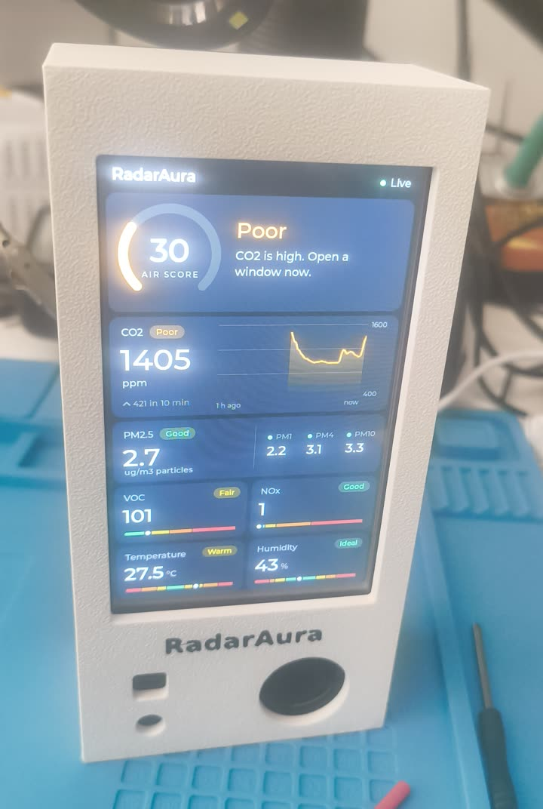
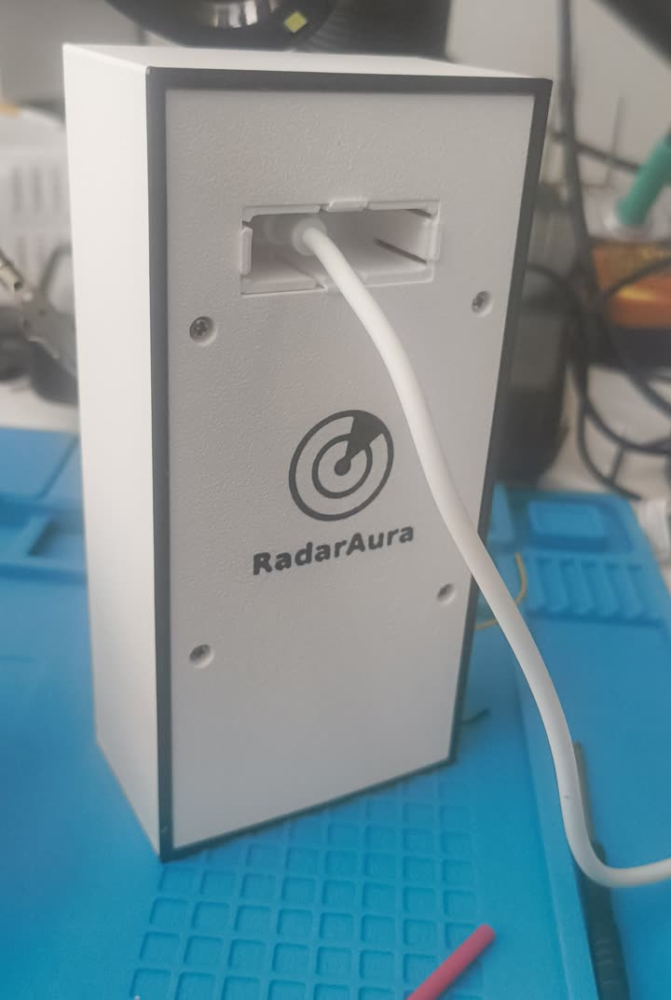
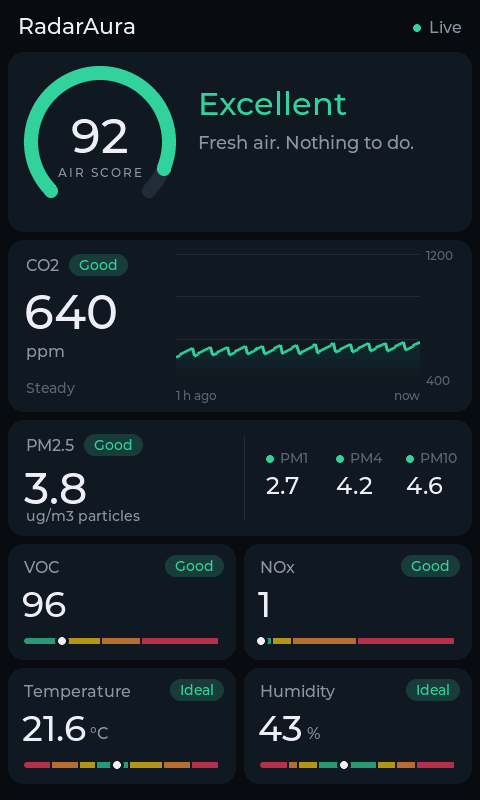
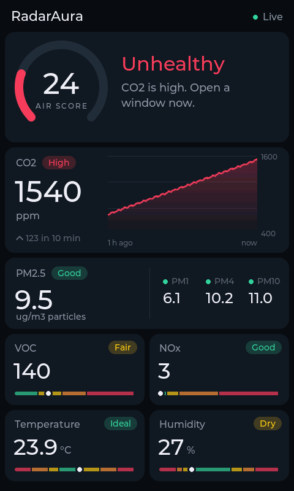
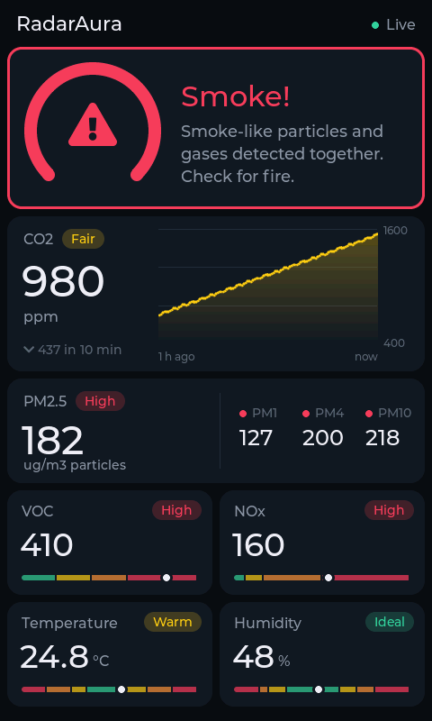
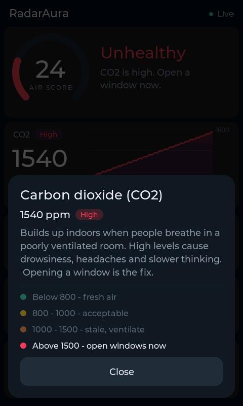

# RadarAura

A desk air-quality monitor: a 4.3" ESP32-P4 touch display plus a Sensirion SEN66
sensor in a 3D-printed case. It shows CO2, particulate matter (PM1/2.5/4/10), VOC
and NOx indices, temperature and humidity, with a one-hour CO2 trend and a plain
"what should I do" line.

**Build guide with wiring pictures: <https://radaraura.com/build/>**

<p>
  
  
</p>

<p>
  
  
  
  
</p>

**Private by design:** no WiFi, no Bluetooth, no microphone. The board's ESP32-C6
radio chip is held in reset from the first instruction and no radio stack is
compiled in; the microphone is never switched on. Everything stays on the device.

## Parts

| Part | Notes |
|---|---|
| Guition JC4880P443C_I_W | ESP32-P4 board with 4.3" 480x800 touch screen (ST7701) |
| Sensirion SEN66 | PM, RH/T, VOC, NOx, CO2 in one module, with its 6-pin cable (1.25 mm, JST GH type) |
| Printed case | See [`case/`](case/README.md): one-colour or two-colour |
| 4x M2 pan-head screws (optional) | The case plugs tightly together and holds without them; screws into the board's standoffs make it extra secure |

**Wiring:** only 4 of the SEN66's 6 wires are needed (pins 5 and 6 repeat GND
and 3.3 V inside the sensor). They go to the board's 2x13 header, on the row
nearest the USB-C ports:

| SEN66 wire | Signal | Header pin |
|---|---|---|
| 1 (end of the plug farthest from the round outlet) | 3.3 V | 1 |
| 2 | GND | 5 |
| 3 | SDA (GPIO7) | 23 |
| 4 | SCL (GPIO8) | 25 |

The first two pins of the other row carry **5 V**: don't use them. I2C address
0x6B; the board already has the pull-ups. Pictures: <https://radaraura.com/build/#wiring>.

## Firmware

Requires [ESP-IDF](https://docs.espressif.com/projects/esp-idf/) 5.3 (tested with 5.3.5).

```sh
cd firmware
idf.py build
idf.py -p /dev/ttyACM0 flash monitor
```

RadarAura has no speaker: warnings, including the smoke warning, are shown on
the screen. The firmware still contains alert-sound code (settings at the top of
`firmware/main/main.c`, spoken alerts via `tools/generate_tts.py`), but the
standard build has nothing to play them on.

> The smoke warning is a convenience, **not a certified smoke detector**. Use a
> real smoke alarm for life safety.

### UI screenshots without hardware

`tools/ui_sim/build.sh` renders the dashboard on a PC to PNGs (run a firmware
build first; it reuses LVGL from `firmware/managed_components`).

## Case

See [`case/README.md`](case/README.md).

## Licence

Free to build and change for yourself, with the RadarAura name kept on the case
and the screen; selling requires permission. Everything is under the
[RadarAura Build Licence](LICENSE.md); the name rules are summed up in
[TRADEMARK.md](TRADEMARK.md).

Copyright (c) 2026 DankBuild.
